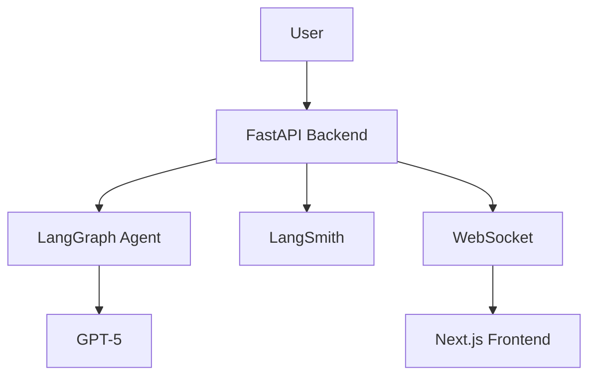

# Architecture Documentation

## Purpose
Technical architecture documentation, design decisions, and system specifications for Deep Agent AGI.

## Contents

### Current Documentation
- Architecture overview (planned)
- Design decisions (documented in CLAUDE.md)
- Data flow diagrams (planned)
- Component interactions (planned)

### Planned Documentation (Phase 1+)
- Detailed component specifications
- Database schema (PostgreSQL with pgvector)
- API architecture
- Security architecture
- Scaling strategy
- Memory system architecture
- Provenance store design

## Key Architectural Decisions

The following architectural decisions have been made (see CLAUDE.md for details):

### Technology Stack
- **Backend:** FastAPI + Python 3.10+
- **Frontend:** Next.js + AG-UI Protocol
- **Database:** PostgreSQL + pgvector (Replit)
- **LLM:** OpenAI GPT-5 with variable reasoning
- **Agent Framework:** LangGraph DeepAgents

### Development Standards
- **Testing:** pytest with 80%+ coverage requirement
- **Code Quality:** Ruff (linting/formatting) + mypy (type checking)
- **CI/CD:** GitHub Actions with parallel jobs
- **Security:** TheAuditor + pre-commit hooks
- **Monitoring:** LangSmith for agent tracing

### Key Patterns
- **Reasoning Router:** GPT-5 effort optimization
- **Event Streaming:** AG-UI Protocol
- **HITL Workflow:** Human-in-the-loop approvals
- **Checkpointer Strategy:** State persistence

## Architecture Diagrams

### System Overview (Planned)
```
[Diagram showing high-level system components and interactions]
```

### Data Flow (Planned)
```
[Diagram showing data flow through the system]
```

### Agent Architecture (Current)
```
User → FastAPI Backend → LangGraph DeepAgents → GPT-5
                ↓
        LangSmith Tracing
                ↓
        WebSocket (AG-UI Protocol) → Next.js Frontend
```

## Adding Architecture Documentation

When documenting architecture:
1. Use diagrams (Mermaid, PlantUML, or ASCII art)
2. Explain rationale for decisions
3. Document alternatives considered
4. Include trade-offs
5. Cross-reference implementation

### Mermaid Example


## Component Documentation

### Backend Components
- [API Layer](../../backend/deep_agent/api/)
- [Agent Layer](../../backend/deep_agent/agent/)
- [Tools](../../backend/deep_agent/tools/)
- [Models](../../backend/deep_agent/models/)

### Frontend Components
- [Next.js App](../../frontend/app/)
- [AG-UI Components](../../frontend/components/)

## Related Documentation
- [Development](../development/)
- [API](../api/)
- [Operations](../operations/)
- [Backend Code](../../backend/deep_agent/)
- [Frontend Code](../../frontend/)

## Future Architecture Plans

### Phase 1: Productionization
- Variable reasoning effort architecture
- Memory system (PostgreSQL pgvector)
- Authentication & IAM
- Provenance store
- Enhanced AG-UI components

### Phase 2: Deep Research
- Deep Research Framework
- Custom MCP Servers (fastmcp)
- Infrastructure hardening
- Cloudflare WAF integration
